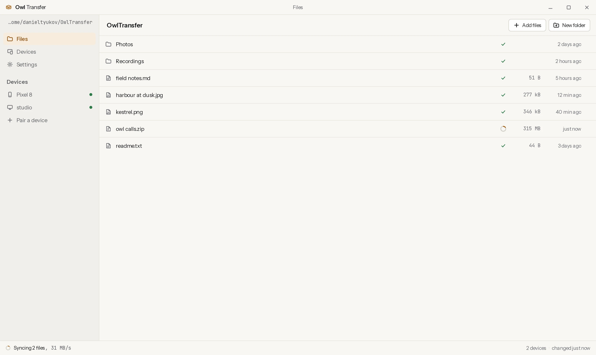
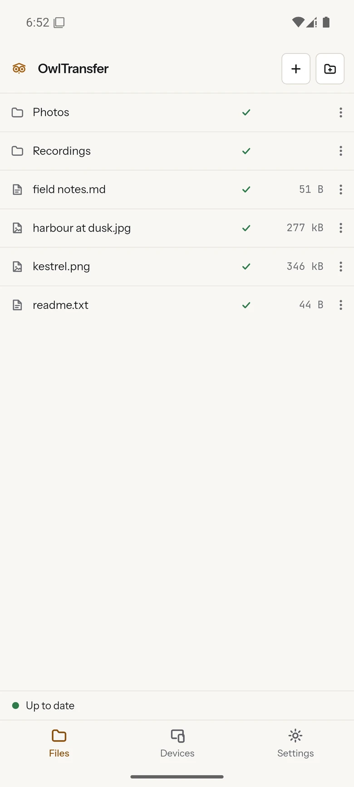

# Owl Transfer

<picture>
  <source media="(prefers-color-scheme: dark)" srcset="docs/img/desktop-dark.webp">
  
</picture>

A folder that is the same on your Linux or Windows desktop and your Android
phone. Drop a file in on one device and it is on the other within a second,
over your own Wi-Fi, with no account and no server. Both devices keep a full
copy, so either one works offline and they catch up when they next see each
other.

Project site: <https://danieltyukov.github.io/owl-transfer/>

## What it is

One ordinary directory per device: `~/OwlTransfer` on the desktop,
`/storage/emulated/0/OwlTransfer` on the phone. Every file manager can see it,
and you can add, rename and delete in it with whatever tool you already use.
The app watches the folder rather than owning it, so nothing has to be imported
and there is no format to get your files back out of.

Each device keeps an index of that folder, one entry per path carrying a hash
and a version vector, and a watcher that rehashes only what changed. A change
is announced to the other device over a single connection and the missing bytes
are pulled in 256 KiB blocks, so a file arrives about as fast as the network
can carry it. A rename costs no transfer at all, because the other side already
holds a file with that hash and copies it locally. Changes made while the two
devices were apart are exchanged the next time they meet, and an edit made on
both sides keeps both, with the loser saved beside the winner rather than
thrown away.

The two devices trust each other because you paired them, once, with both in
front of you. Each generates its own TLS certificate on first run and keeps the
private key. Pairing shows the same six-digit number on both screens, and
approving it stores the other's certificate fingerprint. From then on a
connection is allowed only from a device on that list, and the check happens
during the TLS handshake. Forgetting a device removes it, and the next
connection from it is refused.

It is not a backup, and it is not a cloud drive. A file you delete on one
device is deleted on the other, there is no copy anywhere except on the devices
you paired, and both of them have to be on the same network for anything to
happen. What it does is keep one folder the same between a couple of your own
devices. Selective sync, version history, sharing with other people and
relaying across the internet are all deliberately absent.



## Install

Downloads are on the
[releases page](https://github.com/danieltyukov/owl-transfer/releases/latest).

**Android.** Download `owl-transfer.apk` and open it. Android will ask you to
allow installs from your browser, once. The app then asks for the All files
access permission, which is what lets the sync folder live at
`/storage/emulated/0/OwlTransfer` where every other app can see it; sync stays
paused until you grant it. Releases from this repository are signed with the
maintainer's key, which is not Google's, so an update installs over the top
only if it came from the same place. A fork that builds without the signing
secrets gets an unsigned APK instead, and `SECURITY.md` says what that means.

**Linux.** `owl-transfer_x86_64.AppImage` runs anywhere: `chmod +x` it and run
it. `owl-transfer_amd64.deb` is there for Debian and Ubuntu, installed with
`sudo apt install ./owl-transfer_amd64.deb`. Both are built on Ubuntu 22.04 so
they run on older systems as well as newer ones.

**Windows.** `OwlTransfer_x64-setup.exe` installs for the current user with no
admin prompt and fetches the WebView2 runtime itself if the machine lacks it.
The installer is not code-signed, so SmartScreen asks once: More info, then Run
anyway. `OwlTransfer_x64.msi` is the same build for anyone who deploys with
MSI.

The first launch creates the folder and starts listening. There is no account
step to skip and nothing to configure before it works.

## First run

Put both devices on the same Wi-Fi, then:

1. **Open Devices on the phone.** The desktop should appear under Nearby within
   a few seconds, listed by its hostname. Press Pair.
2. **Check the number.** Both screens show the same six digits. If they match,
   press Accept on the desktop. If they do not, something is answering that is
   not the device you meant, and you should decline.
3. **Drop a file in.** Either side. It is on the other one before you have
   finished switching windows.

If Nearby stays empty, the network is blocking traffic between its clients,
which guest and hotel Wi-Fi usually do. Use Pair by address instead: at the
bottom of the Devices screen each device shows its own addresses and port,
which is what you type on the other one. Only one side has to be able to dial,
because the connection then carries the folder in both directions.

Changes the phone makes itself are indexed immediately. A change made by
another app in shared storage can take up to two seconds to be noticed, because
Android does not deliver file system events for shared storage reliably and the
app polls alongside them.

## What it costs

Nothing, and there is nowhere for a bill to come from, because there is no
service. Your files travel between two devices you own over a network you
already pay for.

| What | Cost |
| --- | --- |
| Syncing between your devices | Nothing. They talk to each other directly, with no relay and no account |
| Storage | Whatever the folder takes on each device. Nothing is stored anywhere else |
| The downloads above | Free. GitHub Actions builds them and GitHub Releases hosts them, both unmetered on a public repository |
| Installing on Android | Free, sideloaded, with no Play Console account anywhere in the picture |

## Build from source

Requires Node 22, npm 10 or newer, and a Rust toolchain from rustup.

```
git clone https://github.com/danieltyukov/owl-transfer.git
cd owl-transfer
npm ci
npm run typecheck
npm test
cargo test -p owl-core
```

That runs the interface tests against an in-memory backend and the engine's own
tests, neither of which needs a device or a network. To build the app itself,
from `app/`, whichever of these applies:

```
npx tauri build --bundles deb,appimage                          # Linux
npx tauri build --bundles nsis,msi                              # Windows
npx tauri android build --apk --target aarch64 --target x86_64  # Android
```

The Linux build needs the WebKitGTK toolchain, the Windows build needs the
Visual Studio Build Tools, and the Android build needs JDK 21 with the SDK and
NDK. `CONTRIBUTING.md` has the exact package lists, the Rust targets Android
wants, and how to run two instances on one machine to try sync without a second
device.

## Repository layout

    crates/core/       owl-core: identity, discovery, transport, index, watcher,
                       sync. No Tauri and no UI, and tested on its own.
    app/src/           React 19 and Vite. The whole interface, on every platform.
    app/src-tauri/     the Rust shell: commands, events, lifecycle, Android hooks
    site/              the one-page project site
    docs/              ARCHITECTURE, the screenshots, the design and plan documents
    scripts/           the font and icon pipelines, run by hand and rarely
    .github/workflows/ ci, release and pages

The engine knows nothing about Tauri, and the interface talks to a `Backend`
interface rather than to Tauri directly. That seam is what lets the same React
code run in a plain browser under test while the same Rust code runs on all
three platforms.

## Documentation

- `docs/ARCHITECTURE.md`, the wire protocol, the index, the merge rules and the
  threat model, written for someone auditing it.
- `CONTRIBUTING.md`, how to build each target, run each suite, and run two
  instances on one machine.
- `SECURITY.md`, where the keys live and how to report a problem.

## Licence

MIT, in `LICENSE`. The two bundled fonts are OFL 1.1 subsets of Instrument Sans
and JetBrains Mono, each shipping its upstream notice beside the file.
